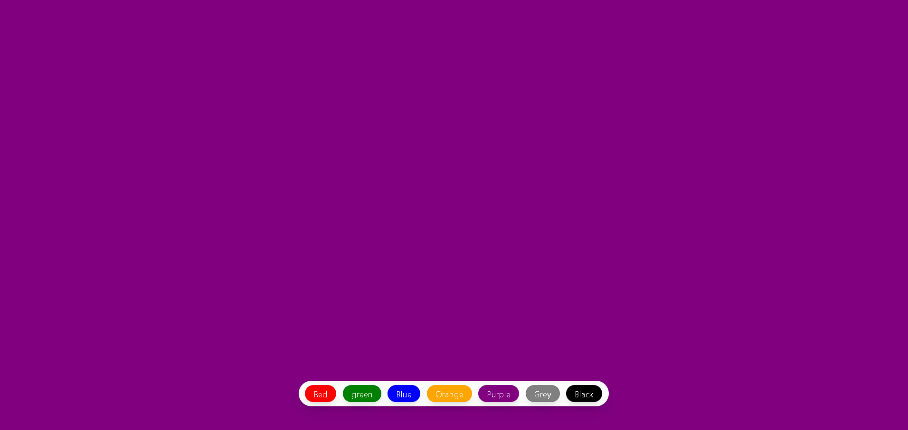

# 🎨 Background Changer App

A simple React-based application that allows users to change the background color of the screen by clicking buttons. It's a fun and beginner-friendly project to understand React state and styling using Tailwind CSS.

## 🔧 Technologies Used
- React.js
- Tailwind CSS
- Vite

## 🚀 How to Run

1. Clone the repository:
git clone https://github.com/Bhuvnesh-Trivedi/BackGround_Changer.git
cd BackGround_Changer

2. Install dependencies:

npm install

3. Start the app:

npm run dev

## 📌 Features
- Click to change background color
- Smooth UI with Tailwind
- Responsive and lightweight

## 👨‍💻 Author
**Bhuvnesh Trivedi**  
GitHub: [@Bhuvnesh-Trivedi](https://github.com/Bhuvnesh-Trivedi)

## Output

